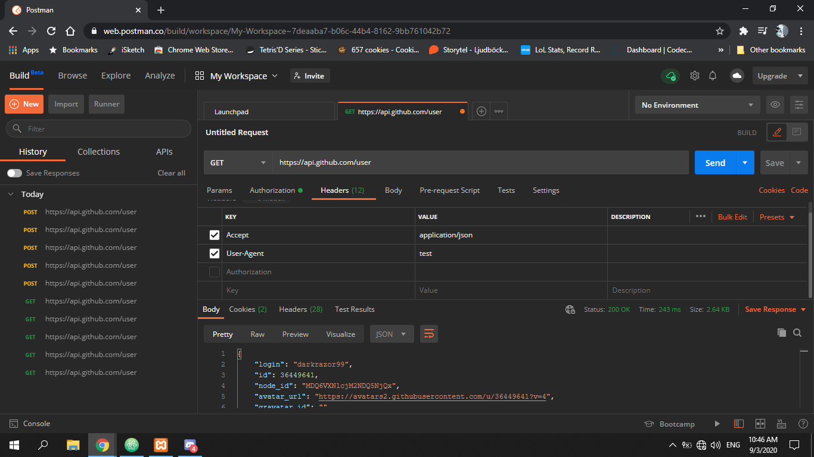

# Login System Using GitHub OAuth API

A simple login system that uses the GitHub OAuth API As a way to register instead of a normal registration from using PHP

## Getting Started
make sure not to edit the name of the folder containing the code when you download it or to be more concise make sure the name of the folder containing this piece of code is loginSystemUsing_GitHubOAuthAPI-master.  
because GitHub will redirect to http://localhost/loginSystemUsing_GitHubOAuthAPI-master/signup.php and if the folder containing the code has a different name an error would accrue.
### Database
You need to create a database and then create a table named users with the following structure.  
```
id int(11) not null PRIMARY KEY AUTO_INCREMENT
login varchar(30) not null
name  varchar(30) not null
password varchar(128) not null
accessToken varchar(128) not null
```  
Make sure the table's name is users and the field names are the same as mentioned above or you are going to have to head to classes/users.class.php and edit the MySQL queries.  

don't know MySQL?  
don't worry you can use the following MySQL code to create a table with the structure mentioned above.
```
CREATE TABLE users(
  id int(11) not null PRIMARY KEY AUTO_INCREMENT,
  login varchar(30) not null ,
  name  varchar(30) not null ,
  password varchar(128) not null ,
  accessToken varchar(128) not null
);
```
### What needs to be edited
After creating the above database head into classes/dbh.class.php and edit the  properties of the class to your convenience  
### Prerequisites

XAMPP or any similar service, see the link bellow for XAMPP

https://www.apachefriends.org/index.html

### development process

the task description was to create A simple login system that uses the GitHub OAuth API As a way to register instead of a normal registration from using PHP.  
When someone registers he has to choose a password for my application and then I have to save the password and his github profile in a MySQL database.    
I first approached this task by reading the document on the GitHub OAuth API  
https://docs.github.com/en/developers/apps/authorizing-oauth-apps  
This is the result I got after missing around with the API using Postman  

After that the main difficulty was to figure out how I am going to send requests to the API and after some research I learned about the cURL Library  this documentation was pretty helpful for learning about this Library:  

https://www.php.net/manual/en/book.curl.php  

I also decided to save the access_token that gets returned on a successful authentication in my database and then use it to get any data I need from the user's GitHub profile instead of making a database with a field for everything and then inserting into it as I found this to be more convenient.  
I am also using prepared statements when inserting to the database and hashing the passwords before inserting them.
